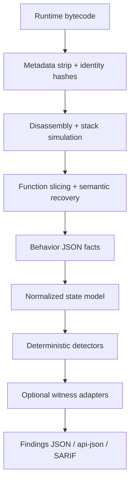

# Architecture Guide

## Pipeline

## Design Rules

1. Bytecode is the primary source of truth.
2. Names and selectors are display hints only.
3. Profiles may annotate semantics but may not contain detector logic.
4. Corpora may validate detectors but may not participate in production matching.
5. Witness backends may corroborate or downgrade findings but may not replace the native detector contract.

## Runtime Surfaces

### `evm_decon`

Responsible for:

- bytecode identity
- control-flow recovery
- action extraction
- storage/memory/call/arithmetic facts
- normalized `state_model`
- reusable in-process pipeline orchestration through `evm_decon.pipeline`

### `evm_check`

Responsible for:

- detector validation
- detector matching
- rule and corpus loading through dedicated loader modules
- counter-evidence handling
- analysis gating
- finding assembly
- SARIF export
- raw checker JSON

### `evm_rule`

Responsible for:

- detector scaffolding
- corpus wiring
- detector validation
- detector anti-pattern linting
- fixture execution
- trace explanation
- detector template generation with reporting summaries

### `evm_audit`

Responsible for:

- one-shot deconstruct + check flow
- direct `--file` and `--hex` input
- merged audit JSON output
- collapsed `api-json` issue output
- SARIF export
- in-process composition of first-party deconstruction and checking services

## Refactor Progress

Completed slices in current codebase:

- `evm_decon.pipeline` extracted as reusable application service
- selector resolution split into service plus cache/HTTP/store adapters
- checker rule and corpus loading split out of `evm_check.engine`

## Why `state_model` Exists

Function-local tags are not enough for serious detectors.

You need a normalized cross-function index to answer questions like:

- which exact slot was written?
- how confident is the semantic role?
- which later path reads the same slot?
- was the read part of an authorization guard?
- which effects were reachable after that guard?
- was the delegatecall target fixed, admin-controlled, or publicly mutable?

That is why multi-step detectors match on `slot_index`, `call_index`, and `path_index` instead of raw tags alone.

## Detector Philosophy

A good detector does not say:

`owner slot written and later read`

A good detector proves:

`the same attacker-controlled slot is later trusted in an authorization predicate that reaches a sensitive effect, absent strong counter-evidence, under acceptable analysis quality`

## Confidence and Proof

Confidence and proof are not the same:

- confidence expresses how reliable the evidence assembly is
- proof level expresses how strong the exploit argument is
- profile hints may improve interpretation but do not become proof unless corroborated by bytecode-derived evidence

High and critical detectors must have real proof strategy and real analysis thresholds.

## Output Surfaces

Use the output surfaces intentionally:

- `evm_decon --format json`
  - behavior facts only
  - no vulnerability decision
- `evm_check --format json`
  - raw detector findings
  - one finding per matched function or matched stateful issue
- `evm_audit --format api-json`
  - issue-oriented API surface
  - collapses duplicate-looking function matches into one issue
  - preserves `match_count` and `affected_functions`
- `evm_audit --format sarif`
  - export-only interoperability format

## Proxy Semantics

The architecture treats proxy semantics explicitly:

- ERC-1967 slots should be recognized as implementation/admin/beacon state
- ERC-1167 fixed clone targets are expected behavior
- mutable or public delegate targets are suspicious

## SARIF

SARIF is export-only. Native findings remain authoritative because they retain richer state-model and witness detail than generic SARIF consumers can express.

## Rule Taxonomy (Go ↔ TS contract)

The system has **three categories** of rule IDs. Confusing them produces dead code and false capability claims.

### 1. Canonical (Go-emitted) rules

Every rule_id under `rules/core/*.json` is canonical. The Go static analyzer (`evm-audit`) loads, evaluates, and emits findings tagged with these IDs.

**Contract:** every rule_id listed in a TS verifier's `RULES` array MUST exist as a canonical Go rule, OR be a sidecar-synthesized rule (category 3 below). Anything else is dead code.

### 2. Defensive aliases (display-only)

Some files maintain rule_id → exposure-surface or rule_id → UI-hint mappings that include historical/alternate IDs (e.g. `selfdestruct.unguarded`, `delegatecall.user_controlled_target`). These are **read-only display defaults** that handle the case where a finding row in the DB (from an older codebase version, an external import, or a third-party feed) carries an ID we no longer emit.

These aliases:
- MAY appear in `rule-surface.ts`, `FindingDetail.tsx`, etc.
- MUST NOT appear in verifier `RULES` arrays (that would falsely claim verification capability)
- MUST NOT appear in `worker.ts` synthesis sites unless promoted to category 3

### 3. Sidecar-synthesized rules (TS-emitted)

The worker runs select verifiers as a sidecar on every contract with any finding, materialising new finding rows when the verifier confirms an exploit the Go static analyzer missed. Currently the only such rule is:

- `economic.unguarded_amm_action` — synthesized by `worker.ts:runEconomicSidecar` when the dynamic AMM-detect verifier finds a swap-on-unguarded-function pattern.

Sidecar rules MUST:
- be wired in `worker.ts` with an explicit `SIDECAR_*_RULE` constant
- have a verifier whose `RULES` array contains them
- be documented here

### Enforcement

A periodic gap-check is part of the build verification:
- Every rule_id in any verifier's `RULES` array must be either a canonical Go rule OR a documented sidecar rule.
- Every canonical Go rule MAY have zero or more fork verifiers. Rules without a verifier produce static-only findings (still valuable, just not fork-confirmed).
- The check is implemented as `panel/scripts/check-rule-alignment.ts`.

### Coverage status (truthful)

The headline `verifier exists for rule X` count is misleading on its own.
The bot has three categories of detection capability. As of 2026-05-18:

| Bucket | Count / 30 | Description |
|---|---|---|
| **Go fires + Fork verifies** | 3 | Rule produces findings on real contracts AND a TS verifier confirms exploit on the fork. `call.arbitrary_external_call_unvalidated_target`, `call.unvalidated_calldataload_target_injection`, `proxy.upgradeTo_unprotected_v2`. |
| **Sidecar-only (Go dormant)** | 6 | Go fact engine can't satisfy the rule's `requires.facts_all` (the facts need flow-sensitive analysis the Go side doesn't do). TS sidecar runs unconditionally on every audited contract — gated by cheap fingerprint check — and materialises findings directly. Listed in `SIDECARS` in `panel/src/server/sim/sidecar.ts`. |
| **Verifier exists but neither fires** | 11 | TS verifier wired, but neither the Go rule fires nor is the rule listed as a sidecar yet. Inventory targets — promote to sidecar or fix Go fact engine to activate. |
| **Static-only by design** | 10 | Patterns whose witnesses are best generated by symbolic execution or fuzz (overflow, randomness gating, EIP-712 domain) — no fork verifier or sidecar planned. |

#### Why sidecars exist

The Go fact engine is intentionally syntactic. It emits things like
`erc20_token_trait` (from selector dictionary) and `BRIDGE_PATTERN` (from
known selector match), but it does NOT emit facts that require flow
analysis like `caller_owner_authorization_absent` or
`proof_root_unbound_or_caller_supplied`. Those facts could be added but
are real engineering work.

Sidecars bypass the gate: the TS verifier runs on every contract and
makes the verdict directly. The Go fingerprint (`global_tags`, `bytecode_fingerprint`)
serves as a cheap pre-filter so we only fork-verify contracts that
plausibly match the verifier's target shape.

#### Sidecar gates currently shipping

| Rule | Gate (Go-fingerprint tag) |
|---|---|
| `economic.unguarded_amm_action` | (none — runs on every contract) |
| `defi.erc4626.withdraw.missing_caller_authorization` | `ERC4626` / `erc4626_vault_trait` / `has_erc4626_pattern` |
| `bridge.forged_cross_chain_proof` | `BRIDGE_PATTERN` / `has_bridge_pattern` |
| `oracle.chainlink_staleness_unchecked` | (none — verifier's own storage probe early-exits cheaply) |
| `defi.swap.missing_slippage_or_deadline` | (none) |
| `token.unsafe_erc20_assumption` | (none) |

The `ERC4626` and `BRIDGE_PATTERN` tags are emitted by
`go/internal/decon/knownbc/knownbc.go` via selector-substring detection.
Adding new gated sidecars usually means: (1) add a `detectXxx` to
`knownbc.go` that emits a new tag in `buildTags`; (2) add the
`SidecarSpec` to `SIDECARS` in `sidecar.ts` with the gate referring to
that tag.
