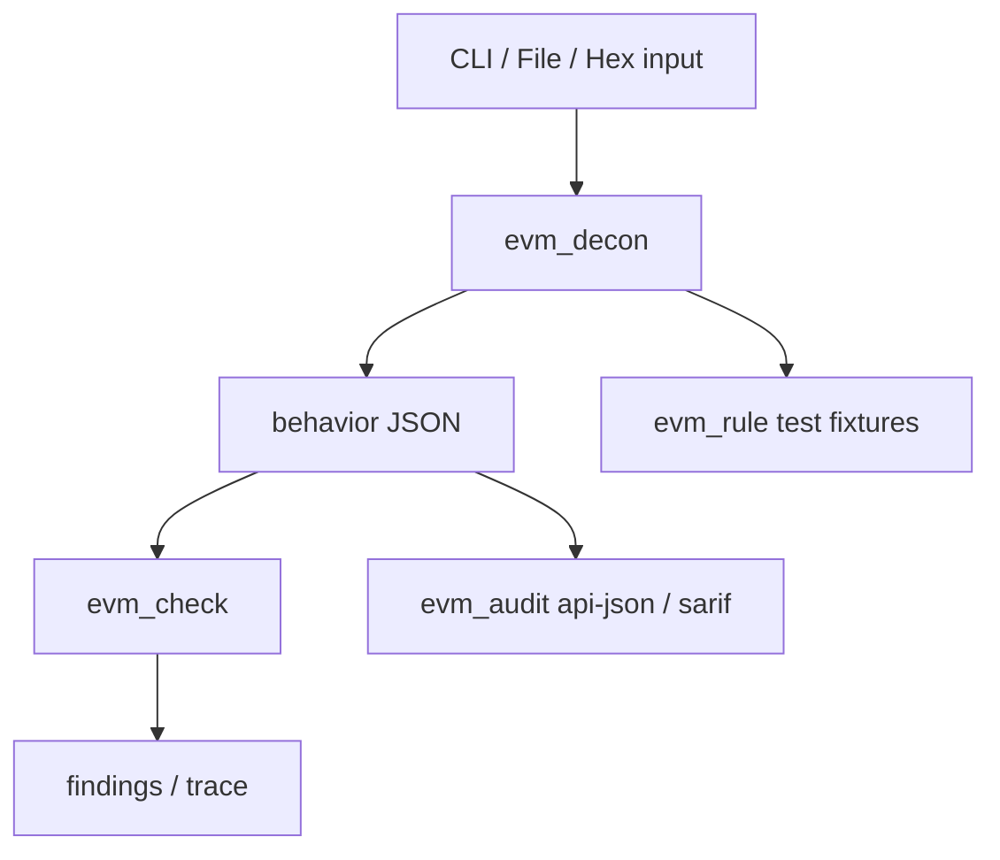
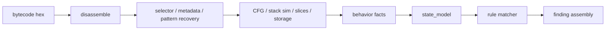

# Architectural Audit Report

Date: 2026-05-02

## Scope

Audited runtime surfaces:

- `evm_decon`
- `evm_check`
- `evm_rule`
- `evm_audit`

Primary inputs reviewed:

- public docs in [README.md](/Users/honeysingh/Projects/misc/evm-contract-auditor/README.md)
- current architecture summary in [ARCHITECTURE_GUIDE.md](/Users/honeysingh/Projects/misc/evm-contract-auditor/ARCHITECTURE_GUIDE.md)
- package entrypoints and highest-complexity modules
- regression suite in [test/test_pancake_regression.py](/Users/honeysingh/Projects/misc/evm-contract-auditor/test/test_pancake_regression.py)

## Executive Summary

Package-level architecture is directionally sound. Product boundaries are clear: deconstruction, checking, rule authoring, and orchestration are separated into distinct runtime surfaces.

Internal architecture is not yet enterprise-grade. Core issues:

- critical logic concentrated in oversized procedural modules
- raw `dict[str, Any]` contracts used across almost every layer
- CLI, file I/O, JSON serialization, and domain orchestration mixed together
- weak centralization for configuration, logging, errors, and validation
- one process shelling out to another for internal orchestration
- narrow test and observability surface

Result: system is workable for research and controlled fixtures, but too brittle for long-term production evolution.

## Phase 1 Findings

### 1. Architecture and Dependency Findings

#### Current component flow

#### Actual coupling hot spots

- `evm_decon/cli.py` previously owned argument parsing, bytecode normalization, pipeline orchestration, progress reporting, and output formatting in one `main()` body. This violated separation of concerns and made `evm_audit` reuse impossible without process spawning.
- `evm_audit/__main__.py` previously called `python -m evm_decon` through `subprocess.run(...)` for first-party functionality instead of importing a service. This added serialization overhead, fragmented error handling, and made observability harder.
- `evm_decon/audit_json.py` is 1,281 lines and acts as assembler, normalizer, inference engine, and formatter for multiple derived structures. This is a god module.
- `evm_check/engine.py` is 700 lines and mixes rule loading, validation, matching, finding assembly, coverage policy, and corpus utilities.
- `evm_rule/__main__.py` contains business logic instead of acting as a thin presentation adapter over a reusable service layer.

#### Dependency issues

- `evm_decon/metadata.py` imports `cbor2`, but `requirements.txt` did not declare it. Fresh installs can fail to decode metadata or drift by environment.
- external selector resolution is implemented ad hoc in `evm_decon/resolver.py` with direct `urllib` calls, file cache writes, and SQLite writes in same module.
- no centralized application settings object; flags are pushed through argparse namespaces and loose booleans.

#### Circular dependency review

No obvious package-level import cycles surfaced in the audited runtime surfaces. Good.

Problem is different: logical coupling without formal cycles. Domain code still depends on incidental runtime concerns such as files, stdout/stderr, and transport formatting.

### 2. Data Flow and Side Effects

#### Current data flow

#### Side-effect inventory

- filesystem reads for bytecode and corpora
- filesystem writes for cache and SQLite signature DB under user home directory
- outbound network calls to 4byte/OpenChain when selector resolution enabled
- subprocess invocation from `evm_audit` to `evm_decon` before this refactor
- stdout/stderr rendering intertwined with domain execution

#### Main side-effect problems

- side effects are not abstracted behind ports/interfaces
- no request-scoped context or correlation id
- no structured event stream for tracing long analyses
- cache/database writes are hidden inside lookup flow rather than explicit infrastructure services

### 3. Code Quality Assessment

#### Repeated patterns

- repeated JSON file loading and dumping across CLIs
- repeated path existence and text loading logic
- repeated audit/rule/corpus validation entry flows
- repeated ad hoc error-to-`ValueError` conversion
- repeated CLI-to-domain argument mapping

#### SOLID violations

- Single Responsibility:
  - `evm_decon/cli.py`
  - `evm_decon/audit_json.py`
  - `evm_check/engine.py`
  - `evm_rule/__main__.py`
- Open/Closed:
  - raw dict schemas force edits across many functions when adding fields
- Dependency Inversion:
  - domain directly depends on file system, HTTP, SQLite, stdout/stderr, and argparse

#### Complexity hotspots

Largest functions found during audit:

- `evm_decon/stack_sim.py:_simulate_block` at 415 lines
- `evm_decon/cli.py:main` at 324 lines before refactor
- `evm_decon/output.py:format_semantic` at 286 lines
- `evm_decon/output.py:build_full_output` at 259 lines
- `evm_check/schema.py:validate_rule` at 126 lines
- `evm_decon/resolver.py:resolve_selectors` at 133 lines

These functions are too large for safe change velocity.

### 4. Risk and Edge-Case Analysis

#### Input edge cases

- invalid hex can still fail deep in `bytes.fromhex(...)` paths rather than at a consistent validation boundary
- empty files and missing files were handled inconsistently between CLIs before service extraction
- several modules assume schema shapes through `.get(...)` chains instead of validated typed objects

#### Async and concurrency

No async runtime. Concurrency risk still exists:

- selector cache file writes in `evm_decon/resolver.py` have no lock
- SQLite writes in `evm_decon/sig_db.py` have no timeout, retry, WAL, or concurrency policy
- parallel analyses can race on shared user-home cache and DB

#### Error handling

- multiple broad `except Exception` blocks suppress root causes:
  - metadata fallback paths
  - selector API paths
  - signature DB stats
- failures degrade silently to partial behavior instead of structured diagnostics
- no typed exception hierarchy for domain, validation, infrastructure, and external dependency failures

#### Security observations

- outbound HTTP dependency uses public signature services without retry/backoff/circuit-breaker policy
- local cache path under home directory is implicit and not configurable
- no resource guardrails on bytecode size, rule size, or corpus size
- no input provenance enforcement for rules/corpora

No direct XSS/auth issues surfaced because project is local CLI-first, not web-facing.

### 5. Type Safety and Validation Findings

- core domain relies on `dict[str, Any]` instead of typed DTOs or validated models
- behavior schema is validated late, not at every ingress boundary
- detector schema is validated through handwritten checks rather than strongly-typed models
- typed dataclasses exist in some lower-level analysis modules, but not at system boundaries where they matter most

### 6. Performance and Scalability Findings

- subprocess boundary between `evm_audit` and `evm_decon` caused avoidable CPU, memory, and serialization overhead
- audit JSON and semantic output build large in-memory structures eagerly
- `audit_json.py` repeatedly transforms wide nested dicts; no streaming or incremental assembly
- selector resolution does network I/O inline during analysis rather than through batched or isolated adapters
- no memoized state-model construction boundaries for repeated rule evaluation

### 7. Test and Observability Findings

- only one regression module discovered in audited tree
- default `python -m unittest -q` discovered zero tests in this environment; test invocation depends on explicit discovery flags
- no unit-test granularity around pipeline orchestration boundaries
- no structured logs, trace ids, metrics, or stage timing
- smoke validation exists, but not as an explicit CI contract inside repo metadata

## Strengths

- product contract is clear and documented
- state model concept is strong and materially better than shallow selector matching
- detector schema discipline is better than typical prototype repos
- corpus-driven regression mindset is correct
- package boundaries are usable foundation for Clean/Hexagonal refactor

## Highest-Priority Refactor Targets

1. Extract application service layer from CLI modules.
2. Replace subprocess orchestration with in-process composition.
3. Introduce typed boundary models for behavior, findings, rules, and corpora.
4. Isolate infrastructure adapters for filesystem, signature resolution, cache, and persistence.
5. Break `audit_json.py`, `engine.py`, and `resolver.py` into focused modules.

## Completed In Current Refactor Pass

- extracted reusable deconstruction application service into `evm_decon.pipeline`
- removed first-party subprocess orchestration from `evm_audit`
- split selector resolution into dedicated cache, HTTP, store, model, and service modules
- extracted checker rule loading and corpus loading out of `evm_check.engine`
