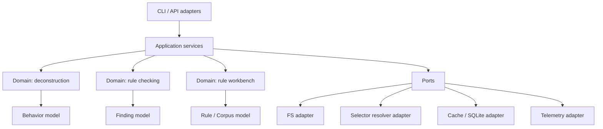
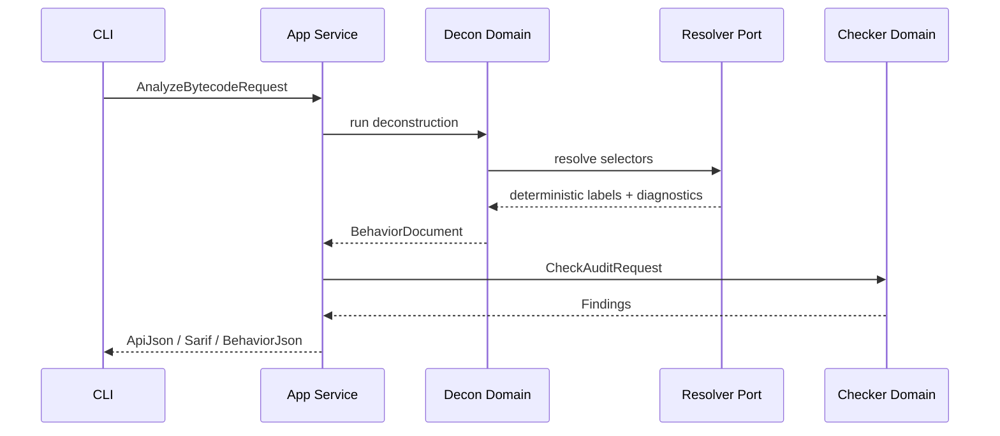

# Architectural Refactor Plan

Date: 2026-05-02

## Target Architecture

Recommended architecture: Clean Architecture with Hexagonal edges.

Reason:

- bytecode analysis and detector logic are core domain
- CLI, filesystem, network, SQLite, and export formats are adapters
- system already has natural bounded contexts that map well to ports and use cases

## Proposed Structure

## Layer Responsibilities

### Domain

- bytecode analysis
- semantic recovery
- state-model construction
- detector matching
- witness generation
- rule/corpus invariants

### Application

- orchestrate use cases
- map inputs to domain requests
- manage policy, retries, timeouts, and feature flags
- emit telemetry and structured errors

### Infrastructure

- filesystem
- cache and SQLite
- external selector APIs
- SARIF and API-JSON export
- profile registry loading

## Refactor Slices

### Slice 1: Application service extraction

Status: started in this refactor.

Actions:

- create reusable `evm_decon.pipeline` service
- make `evm_decon.cli` presentation-only
- remove subprocess hop from `evm_audit`

### Slice 2: Boundary models

Actions:

- add Pydantic models for:
  - behavior document
  - state model
  - detector rule
  - corpus manifest
  - checker finding
- validate at ingress and egress boundaries

Recommended libraries:

- `pydantic` for boundary DTOs and env/config
- `typing_extensions` if older Python support needed

### Slice 3: Infrastructure ports

Actions:

- define `SelectorResolverPort`
- define `SignatureStorePort`
- define `AuditRepositoryPort`
- define `TelemetryPort`
- move `urllib`, filesystem cache, and SQLite into adapters

Recommended libraries:

- `httpx` for HTTP client with timeouts and retry middleware
- `tenacity` for retries and backoff
- `structlog` for structured logging

### Slice 4: Break monolith modules

Break `evm_decon/audit_json.py` into:

- `identity_builder.py`
- `function_builder.py`
- `storage_builder.py`
- `state_model_builder.py`
- `coverage_builder.py`
- `warning_builder.py`

Break `evm_check/engine.py` into:

- `rule_loader.py`
- `rule_matcher.py`
- `sequence_matcher.py`
- `finding_builder.py`
- `coverage_policy.py`
- `corpus_loader.py`

Break `evm_decon/resolver.py` into:

- `resolver_service.py`
- `resolver_http_adapter.py`
- `resolver_cache_adapter.py`
- `resolver_models.py`

### Slice 5: Telemetry and resilience

Actions:

- add request id / analysis id
- emit stage timings
- emit selector resolution stats
- add typed warnings and degradation reasons
- add circuit breaker for external resolution

Recommended libraries:

- `structlog`
- `prometheus-client` for metrics export if service mode added later

## New Runtime Flow

## Breaking Changes

Planned and acceptable:

1. Internal programmatic callers should stop shelling out to `python -m evm_decon`.
2. Boundary objects should become typed models instead of raw dict mutation surfaces.
3. Cache/DB location should move to explicit configuration instead of implicit home-directory defaults.
4. Network selector resolution should become opt-in adapter configuration, not hidden ambient behavior.
5. CLI internals should stop passing raw argparse namespaces into domain code.

## Migration Plan

### For repo maintainers

1. Move shared use cases behind service modules.
2. Add typed DTOs with compatibility loaders for current JSON.
3. Replace direct dict mutation with model transformations.
4. Split monolith builders without changing public schemas first.
5. Add structured telemetry before larger algorithmic rewrites.

### For downstream callers

1. Prefer importing service functions instead of spawning subprocesses.
2. Treat behavior and findings as schema contracts, not mutable internal dicts.
3. Pin schema versions in automation.

## Testing Strategy

### Unit tests

- bytecode input normalization and validation
- selector resolver adapters
- rule schema validation
- sequence matcher joins
- confidence and coverage policy
- audit JSON builders by section

### Integration tests

- `evm_decon.pipeline` end-to-end on fixture bytecode
- `evm_audit` api-json generation
- rule corpus execution
- selector resolution degradation with network disabled

### Non-functional tests

- repeated parallel runs against shared cache/DB paths
- large bytecode stress tests
- malformed rule/corpus fuzz cases

### Tooling recommendations

- keep `unittest` fixtures if desired, but standardize on `pytest` for discovery and parametrization
- add `ruff` for lint
- add `mypy` or `pyright` once boundary models land

## What Changed In This Refactor

- introduced reusable `evm_decon.pipeline`
- turned `evm_decon.cli` into thin adapter over service layer
- removed `evm_audit` subprocess dependency on first-party module
- split selector resolution into service, cache, HTTP, model, and store modules
- extracted checker rule loading and corpus loading into dedicated modules
- added missing `cbor2` runtime dependency

## Next Recommended Work Order

1. Typed models for behavior/rules/findings.
2. Resolver/cache/SQLite adapter split.
3. `evm_check.engine` decomposition.
4. `evm_decon.audit_json` decomposition.
5. Structured telemetry and CI-hard test entrypoints.
